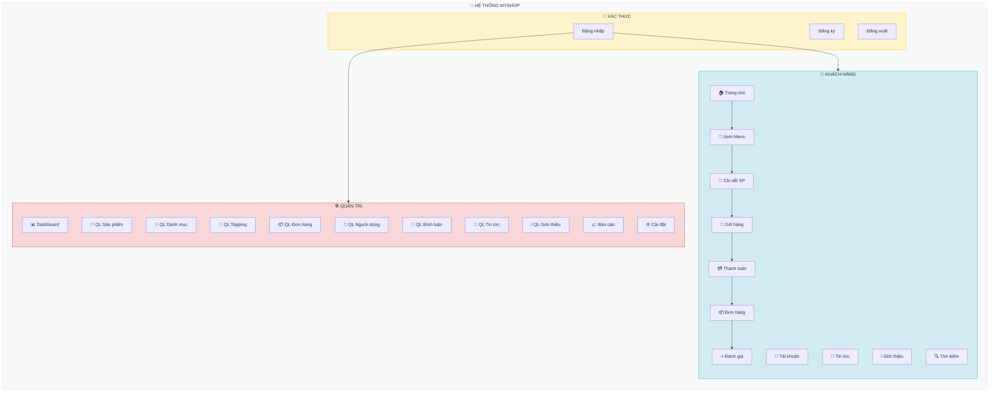
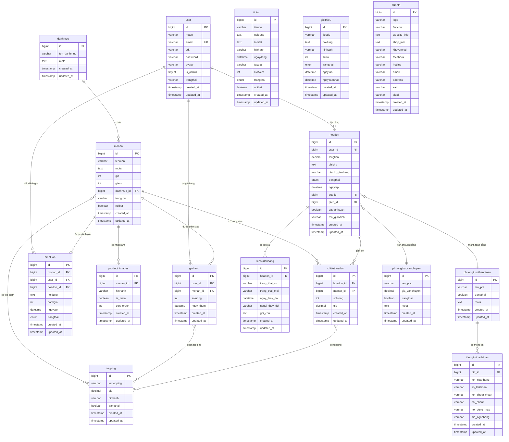
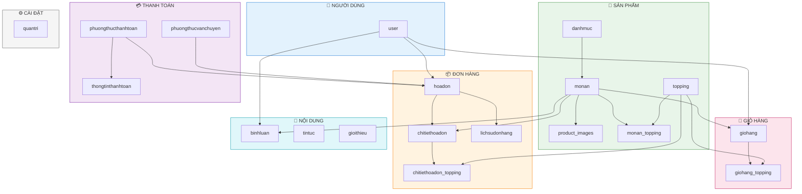

  
  
  
  

<h1 align="center">🍜 MyShop - Website Bán Đồ Ăn Online</h1>

  <strong>Hệ thống quản lý bán hàng đồ ăn trực tuyến với đầy đủ tính năng</strong>

---

## 📋 Mục Lục

- [1. Tổng Quan Dự Án](#1-tổng-quan-dự-án)
- [2. Danh Sách Chức Năng](#2-danh-sách-chức-năng)
- [3. Sơ Đồ Chức Năng Hệ Thống](#3-sơ-đồ-chức-năng-hệ-thống)
- [4. Thiết Kế Cơ Sở Dữ Liệu](#4-thiết-kế-cơ-sở-dữ-liệu)
- [5. Sơ Đồ Quan Hệ ERD](#5-sơ-đồ-quan-hệ-erd)
- [6. Công Nghệ Sử Dụng](#6-công-nghệ-sử-dụng)

---

## 1. Tổng Quan Dự Án

| Thông Tin | Chi Tiết |
|-----------|----------|
| **Tên dự án** | MyShop - Food Ordering System |
| **Loại ứng dụng** | Website E-commerce (Bán đồ ăn) |
| **Framework** | Laravel 8.x |
| **Database** | MySQL |
| **Số bảng CSDL** | 19 bảng |
| **Phân hệ** | Frontend (Khách hàng) + Backend (Admin) |

---

## 2. Danh Sách Chức Năng

### 2.1. 👤 Phân Hệ Khách Hàng (Frontend)

| STT | Module | Chức năng | Mô tả chi tiết |
|:---:|--------|-----------|----------------|
| 1 | **🏠 Trang chủ** | Hiển thị tổng quan | Sản phẩm nổi bật, danh mục, tin tức mới nhất |
| 2 | **🔐 Xác thực** | Đăng ký tài khoản | Tạo tài khoản mới với email, mật khẩu |
| 3 | | Đăng nhập | Xác thực bằng email/mật khẩu |
| 4 | | Đăng xuất | Kết thúc phiên đăng nhập |
| 5 | **🍕 Sản phẩm** | Xem danh sách menu | Duyệt sản phẩm theo danh mục, lọc, sắp xếp, phân trang |
| 6 | | Chi tiết sản phẩm | Xem thông tin, giá, gallery hình ảnh, đánh giá |
| 7 | | Chọn topping | Thêm topping cho món ăn |
| 8 | | Tìm kiếm | Tìm sản phẩm theo từ khóa |
| 9 | **🛒 Giỏ hàng** | Thêm vào giỏ | Thêm sản phẩm + topping vào giỏ hàng |
| 10 | | Cập nhật giỏ hàng | Thay đổi số lượng, xóa sản phẩm |
| 11 | | Xem giỏ hàng | Hiển thị danh sách sản phẩm đã chọn |
| 12 | **📦 Đơn hàng** | Thanh toán (Checkout) | Chọn PTTT, PTVC, nhập địa chỉ, ghi chú |
| 13 | | Xem đơn hàng của tôi | Danh sách đơn hàng đã đặt |
| 14 | | Chi tiết đơn hàng | Xem sản phẩm, trạng thái, tổng tiền |
| 15 | | Hủy đơn hàng | Hủy đơn (chỉ khi chờ xác nhận) |
| 16 | | Đặt lại đơn hàng | Đặt lại từ đơn cũ |
| 17 | **⭐ Đánh giá** | Viết bình luận | Đánh giá sao + nội dung (sau khi mua) |
| 18 | **👤 Tài khoản** | Trang cá nhân | Xem/cập nhật thông tin cá nhân |
| 19 | | Đổi mật khẩu | Thay đổi mật khẩu |
| 20 | | Đổi avatar | Upload ảnh đại diện |
| 21 | **📰 Tin tức** | Danh sách tin tức | Xem các bài viết mới |
| 22 | | Chi tiết tin tức | Đọc nội dung bài viết |
| 23 | **ℹ️ Thông tin** | Giới thiệu | Thông tin về cửa hàng |
| 24 | | Liên hệ | Form gửi liên hệ |

---

### 2.2. 🛠️ Phân Hệ Quản Trị (Admin Panel)

| STT | Module | Chức năng | Mô tả chi tiết |
|:---:|--------|-----------|----------------|
| 1 | **📊 Dashboard** | Thống kê tổng quan | Doanh thu, đơn hàng, người dùng, biểu đồ |
| 2 | **🍕 Sản phẩm** | Danh sách sản phẩm | Xem, tìm kiếm, lọc, phân trang |
| 3 | | Thêm sản phẩm | Nhập thông tin, upload nhiều hình ảnh |
| 4 | | Sửa sản phẩm | Cập nhật thông tin, quản lý hình ảnh |
| 5 | | Xóa sản phẩm | Xóa sản phẩm (soft delete) |
| 6 | | Đánh dấu nổi bật | Bật/tắt sản phẩm nổi bật |
| 7 | **📂 Danh mục** | CRUD Danh mục | Thêm/Sửa/Xóa/Xem danh mục |
| 8 | **🧁 Topping** | CRUD Topping | Quản lý topping cho món ăn |
| 9 | **📦 Đơn hàng** | Danh sách đơn hàng | Xem tất cả đơn, lọc theo trạng thái |
| 10 | | Chi tiết đơn hàng | Xem chi tiết sản phẩm, khách hàng |
| 11 | | Cập nhật trạng thái | Xác nhận, giao hàng, hoàn tất, hủy |
| 12 | | Cập nhật thanh toán | Đánh dấu đã thanh toán |
| 13 | | In đơn hàng | In hóa đơn PDF |
| 14 | | Xuất Excel | Export danh sách đơn hàng |
| 15 | **👥 Người dùng** | Danh sách users | Xem tất cả người dùng |
| 16 | | Thêm người dùng | Tạo user mới |
| 17 | | Sửa người dùng | Cập nhật thông tin, phân quyền |
| 18 | | Khóa/Mở khóa | Thay đổi trạng thái tài khoản |
| 19 | | Phân quyền | Admin / Nhân viên / Khách hàng |
| 20 | **💬 Bình luận** | Danh sách bình luận | Xem tất cả đánh giá |
| 21 | | Duyệt bình luận | Phê duyệt/Từ chối |
| 22 | | Ẩn bình luận | Ẩn bình luận vi phạm |
| 23 | | Xóa bình luận | Xóa vĩnh viễn |
| 24 | **📰 Tin tức** | CRUD Tin tức | Quản lý bài viết |
| 25 | | Trạng thái | Công khai / Bản nháp / Ẩn |
| 26 | | Tin nổi bật | Đánh dấu tin tức nổi bật |
| 27 | **ℹ️ Giới thiệu** | CRUD About | Quản lý nội dung giới thiệu |
| 28 | **📈 Báo cáo** | Thống kê doanh thu | Theo ngày/tuần/tháng/năm |
| 29 | | Biểu đồ | Chart.js visualization |
| 30 | **⚙️ Cài đặt** | Logo & Favicon | Upload logo, favicon website |
| 31 | | Thông tin shop | Địa chỉ, hotline, email |
| 32 | | Mạng xã hội | Facebook, Zalo, Tiktok |
| 33 | | Phương thức thanh toán | Quản lý PTTT |
| 34 | | Thông tin ngân hàng | STK, tên chủ TK, mã NH |
| 35 | | Phương thức vận chuyển | Quản lý PTVC, phí ship |

---

## 3. Sơ Đồ Chức Năng Hệ Thống

### 3.1. Sơ Đồ Tổng Quan

---

### 3.2. Luồng Đặt Hàng Chi Tiết

```mermaid
flowchart LR
    subgraph BROWSE["1️⃣ DUYỆT SẢN PHẨM"]
        B1["Xem Menu"] --> B2["Chọn danh mục"]
        B2 --> B3["Xem chi tiết"]
        B3 --> B4["Chọn topping"]
    end
    
    subgraph CART["2️⃣ GIỎ HÀNG"]
        C1["Thêm vào giỏ"] --> C2["Cập nhật SL"]
        C2 --> C3["Xem giỏ hàng"]
    end
    
    subgraph CHECKOUT["3️⃣ THANH TOÁN"]
        CH1["Nhập địa chỉ"] --> CH2["Chọn PTTT"]
        CH2 --> CH3["Chọn PTVC"]
        CH3 --> CH4["Xác nhận đặt"]
    end
    
    subgraph ORDER["4️⃣ ĐƠN HÀNG"]
        O1["Chờ xác nhận"] --> O2["Đã xác nhận"]
        O2 --> O3["Đang giao"]
        O3 --> O4["Hoàn tất"]
        O1 -.-> O5["Đã hủy"]
    end
    
    subgraph REVIEW["5️⃣ ĐÁNH GIÁ"]
        R1["Viết đánh giá"] --> R2["Cho điểm sao"]
    end
    
    B4 --> C1
    C3 --> CH1
    CH4 --> O1
    O4 --> R1
    
    style BROWSE fill:#e3f2fd,stroke:#2196f3
    style CART fill:#fff8e1,stroke:#ffc107
    style CHECKOUT fill:#e8f5e9,stroke:#4caf50
    style ORDER fill:#fce4ec,stroke:#e91e63
    style REVIEW fill:#f3e5f5,stroke:#9c27b0
```

---

## 4. Thiết Kế Cơ Sở Dữ Liệu

### 4.1. Danh Sách 19 Bảng

| STT | Tên Bảng | Mô Tả | Số Cột |
|:---:|----------|-------|:------:|
| 1 | `user` | Người dùng (khách hàng, admin, nhân viên) | 9 |
| 2 | `danhmuc` | Danh mục sản phẩm | 4 |
| 3 | `monan` | Sản phẩm / Món ăn | 9 |
| 4 | `product_images` | Hình ảnh sản phẩm (gallery) | 6 |
| 5 | `topping` | Topping cho món ăn | 6 |
| 6 | `monan_topping` | Bảng liên kết Món ăn - Topping | 2 |
| 7 | `giohang` | Giỏ hàng | 6 |
| 8 | `giohang_topping` | Topping trong giỏ hàng | 3 |
| 9 | `hoadon` | Đơn hàng / Hóa đơn | 12 |
| 10 | `chitiethoadon` | Chi tiết đơn hàng | 6 |
| 11 | `chitiethoadon_topping` | Topping trong đơn hàng | 5 |
| 12 | `lichsudonhang` | Lịch sử trạng thái đơn hàng | 7 |
| 13 | `phuongthucthanhtoan` | Phương thức thanh toán | 5 |
| 14 | `phuongthucvanchuyen` | Phương thức vận chuyển | 6 |
| 15 | `thongtinthanhtoan` | Thông tin ngân hàng | 8 |
| 16 | `binhluan` | Bình luận / Đánh giá sản phẩm | 9 |
| 17 | `tintuc` | Tin tức / Bài viết | 11 |
| 18 | `gioithieu` | Nội dung trang Giới thiệu | 8 |
| 19 | `quantri` | Cài đặt website | 14 |

---

### 4.2. Chi Tiết Cấu Trúc Các Bảng Chính

#### 📌 Bảng `user` - Người dùng

| Cột | Kiểu dữ liệu | Ràng buộc | Mô tả |
|-----|--------------|-----------|-------|
| `id` | BIGINT | PK, Auto Increment | ID người dùng |
| `hoten` | VARCHAR(100) | NOT NULL | Họ và tên |
| `email` | VARCHAR(100) | UNIQUE, NULL | Email đăng nhập |
| `sdt` | VARCHAR(15) | NULL | Số điện thoại |
| `password` | VARCHAR(255) | NOT NULL | Mật khẩu (hashed) |
| `avatar` | VARCHAR(255) | NULL | Đường dẫn ảnh đại diện |
| `is_admin` | TINYINT | DEFAULT 0 | 0=Khách, 1=Admin, 2=Nhân viên |
| `trangthai` | VARCHAR(50) | DEFAULT 'Hoạt động' | Hoạt động / Khóa |
| `created_at` | TIMESTAMP | | Ngày tạo |
| `updated_at` | TIMESTAMP | | Ngày cập nhật |

---

#### 📌 Bảng `danhmuc` - Danh mục

| Cột | Kiểu dữ liệu | Ràng buộc | Mô tả |
|-----|--------------|-----------|-------|
| `id` | BIGINT | PK, Auto Increment | ID danh mục |
| `ten_danhmuc` | VARCHAR(100) | NOT NULL | Tên danh mục |
| `mota` | TEXT | NULL | Mô tả danh mục |
| `created_at` | TIMESTAMP | | Ngày tạo |
| `updated_at` | TIMESTAMP | | Ngày cập nhật |

---

#### 📌 Bảng `monan` - Sản phẩm

| Cột | Kiểu dữ liệu | Ràng buộc | Mô tả |
|-----|--------------|-----------|-------|
| `id` | BIGINT | PK, Auto Increment | ID sản phẩm |
| `tenmon` | VARCHAR(100) | NOT NULL | Tên món ăn |
| `mota` | TEXT | NULL | Mô tả chi tiết |
| `gia` | INT | NOT NULL | Giá hiện tại (VNĐ) |
| `giacu` | INT | NULL | Giá cũ (nếu có giảm giá) |
| `danhmuc_id` | BIGINT | FK → danhmuc(id) | ID danh mục |
| `trangthai` | VARCHAR(50) | DEFAULT 'Đang bán' | Đang bán / Hết hàng / Ngừng KD |
| `noibat` | BOOLEAN | DEFAULT FALSE | Sản phẩm nổi bật |
| `created_at` | TIMESTAMP | | Ngày tạo |
| `updated_at` | TIMESTAMP | | Ngày cập nhật |

---

#### 📌 Bảng `hoadon` - Đơn hàng

| Cột | Kiểu dữ liệu | Ràng buộc | Mô tả |
|-----|--------------|-----------|-------|
| `id` | BIGINT | PK, Auto Increment | ID đơn hàng |
| `user_id` | BIGINT | FK → user(id) | ID người đặt |
| `tongtien` | DECIMAL(12,2) | NULL | Tổng tiền đơn hàng |
| `ghichu` | TEXT | NULL | Ghi chú của khách |
| `diachi_giaohang` | VARCHAR(255) | NOT NULL | Địa chỉ giao hàng |
| `trangthai` | ENUM | DEFAULT 'Chờ xác nhận' | Trạng thái đơn |
| `ngaylap` | DATETIME | | Ngày đặt hàng |
| `pttt_id` | BIGINT | FK → phuongthucthanhtoan(id) | Phương thức thanh toán |
| `ptvc_id` | BIGINT | FK → phuongthucvanchuyen(id) | Phương thức vận chuyển |
| `dathanhtoan` | BOOLEAN | DEFAULT FALSE | Đã thanh toán chưa |
| `ma_giaodich` | VARCHAR(100) | NULL | Mã giao dịch |

> **Trạng thái đơn hàng:** `Chờ xác nhận` → `Đã xác nhận` → `Đang giao` → `Hoàn tất` | `Đã hủy`

---

#### 📌 Bảng `chitiethoadon` - Chi tiết đơn hàng

| Cột | Kiểu dữ liệu | Ràng buộc | Mô tả |
|-----|--------------|-----------|-------|
| `id` | BIGINT | PK, Auto Increment | ID chi tiết |
| `hoadon_id` | BIGINT | FK → hoadon(id) | ID đơn hàng |
| `monan_id` | BIGINT | FK → monan(id) | ID sản phẩm |
| `soluong` | INT | | Số lượng |
| `gia` | DECIMAL(10,2) | | Đơn giá tại thời điểm mua |

---

#### 📌 Bảng `binhluan` - Bình luận / Đánh giá

| Cột | Kiểu dữ liệu | Ràng buộc | Mô tả |
|-----|--------------|-----------|-------|
| `id` | BIGINT | PK, Auto Increment | ID bình luận |
| `monan_id` | BIGINT | FK → monan(id) | ID sản phẩm |
| `user_id` | BIGINT | FK → user(id) | ID người bình luận |
| `hoadon_id` | BIGINT | FK → hoadon(id) | ID đơn hàng (đã mua mới được đánh giá) |
| `noidung` | TEXT | NULL | Nội dung bình luận |
| `danhgia` | INT | NOT NULL | Số sao (1-5) |
| `ngaytao` | DATETIME | | Ngày tạo |
| `trangthai` | ENUM | DEFAULT 'Chờ duyệt' | Chờ duyệt / Đã duyệt / Bị ẩn |

---

#### 📌 Bảng `topping` - Topping

| Cột | Kiểu dữ liệu | Ràng buộc | Mô tả |
|-----|--------------|-----------|-------|
| `id` | BIGINT | PK, Auto Increment | ID topping |
| `tentopping` | VARCHAR(100) | NOT NULL | Tên topping |
| `gia` | DECIMAL(12,0) | DEFAULT 0 | Giá topping |
| `hinhanh` | VARCHAR(255) | NULL | Hình ảnh |
| `trangthai` | BOOLEAN | DEFAULT TRUE | Hoạt động / Tạm khóa |

---

#### 📌 Bảng `tintuc` - Tin tức

| Cột | Kiểu dữ liệu | Ràng buộc | Mô tả |
|-----|--------------|-----------|-------|
| `id` | BIGINT | PK, Auto Increment | ID tin tức |
| `tieude` | VARCHAR(200) | NOT NULL | Tiêu đề |
| `noidung` | TEXT | NOT NULL | Nội dung bài viết |
| `tomtat` | TEXT | NULL | Tóm tắt |
| `hinhanh` | VARCHAR(255) | NULL | Hình ảnh đại diện |
| `ngaydang` | DATETIME | | Ngày đăng |
| `tacgia` | VARCHAR(100) | NULL | Tác giả |
| `luotxem` | INT | DEFAULT 0 | Lượt xem |
| `trangthai` | ENUM | DEFAULT 'Công khai' | Công khai / Bản nháp / Ẩn |
| `noibat` | BOOLEAN | DEFAULT FALSE | Tin nổi bật |

---

## 5. Sơ Đồ Quan Hệ ERD

### 5.1. Sơ Đồ ERD Đầy Đủ

---

### 5.2. Sơ Đồ Quan Hệ Đơn Giản

---

## 6. Công Nghệ Sử Dụng

| Layer | Công nghệ | Phiên bản |
|-------|-----------|-----------|
| **Backend** | Laravel | 8.x |
| **Language** | PHP | 7.3+ / 8.0 |
| **Database** | MySQL | 5.7+ |
| **Frontend** | Blade Template | - |
| **CSS Framework** | Bootstrap | 5.x |
| **JavaScript** | Vanilla JS / jQuery | - |
| **Charts** | Chart.js | - |
| **API** | Laravel Sanctum | 2.11 |
| **Server** | Apache (XAMPP) | - |
| **Version Control** | Git | - |

---

  <strong>📝 Tài liệu được tạo ngày: 01/01/2026</strong>

