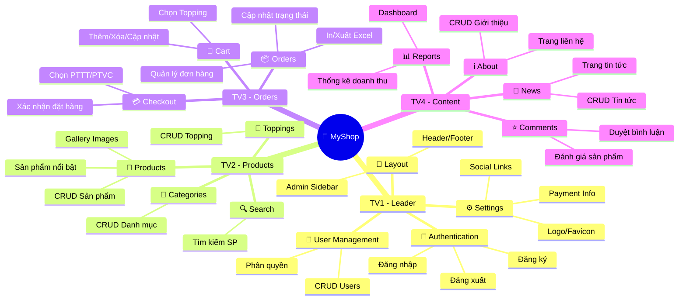
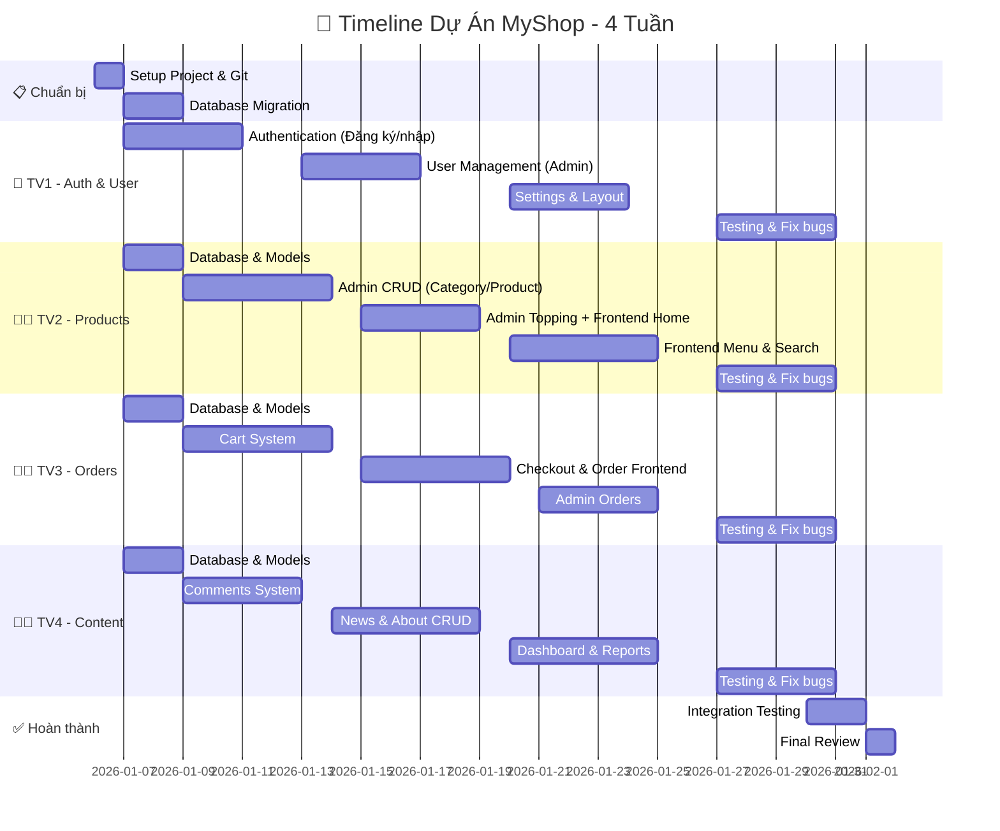
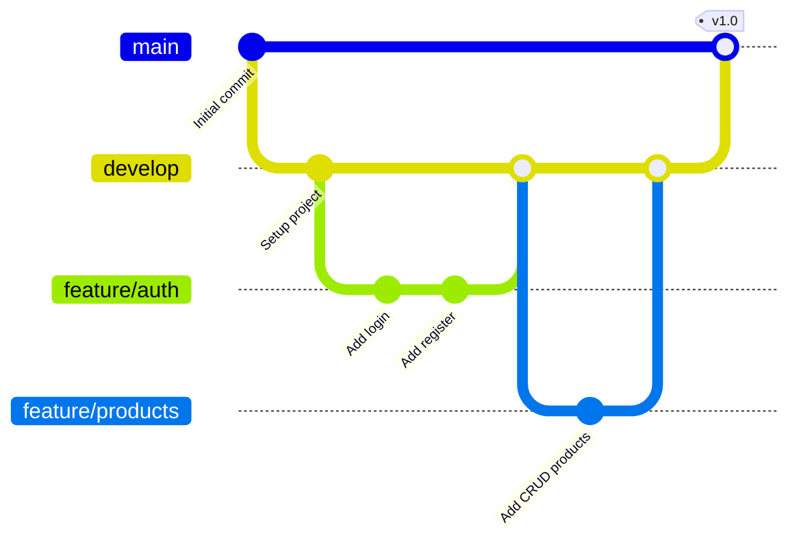

<p align="center">
  
  
  
</p>

<h1 align="center">👥 Phân Công Công Việc - Dự Án MyShop</h1>

<p align="center">
  <strong>Tài liệu phân công chi tiết cho nhóm 4 thành viên</strong>
</p>

---

## 📋 Mục Lục

- [1. Tổng Quan Phân Công](#1-tổng-quan-phân-công)
- [2. Chi Tiết Công Việc Từng Thành Viên](#2-chi-tiết-công-việc-từng-thành-viên)
- [3. Timeline Dự Án](#3-timeline-dự-án)
- [4. Checklist Theo Dõi Tiến Độ](#4-checklist-theo-dõi-tiến-độ)
- [5. Quy Tắc Làm Việc Nhóm](#5-quy-tắc-làm-việc-nhóm)

---

## 1. Tổng Quan Phân Công

### 1.1. Bảng Phân Chia Module

| Thành Viên | Vai Trò | Module Phụ Trách | Độ Khó |
|:----------:|---------|------------------|:------:|
| **TV1** | 👑 Leader | Authentication + User + Settings + Layout | ⭐⭐⭐ |
| **TV2** | 👨‍💻 Dev | Products + Categories + Toppings | ⭐⭐⭐⭐ |
| **TV3** | 👨‍💻 Dev | Orders + Cart + Payments | ⭐⭐⭐⭐⭐ |
| **TV4** | 👨‍💻 Dev | Comments + News + About + Reports | ⭐⭐⭐ |

---

### 1.2. Sơ Đồ Phân Công



---

## 2. Chi Tiết Công Việc Từng Thành Viên

---

### 👑 Thành Viên 1 - Authentication & User (Leader)

**Bảng CSDL phụ trách:** `user`, `quantri`

| STT | Task ID | Công việc | Mô tả chi tiết | Thời gian |
|:---:|---------|-----------|----------------|:---------:|
| 1 | T1.1 | Database `user` | Migration, Model User với roles | 2h |
| 2 | T1.2 | Đăng ký (Frontend) | Form đăng ký, validate, tạo user | 3h |
| 3 | T1.3 | Đăng nhập (Frontend) | Form login, session, remember me | 3h |
| 4 | T1.4 | Đăng xuất | Logout, clear session | 1h |
| 5 | T1.5 | Đăng nhập Admin | Admin login riêng biệt | 2h |
| 6 | T1.6 | Middleware Auth | Auth middleware cho user & admin | 2h |
| 7 | T1.7 | Profile - Xem/Sửa | Trang cá nhân, cập nhật thông tin | 3h |
| 8 | T1.8 | Profile - Đổi mật khẩu | Validate mật khẩu cũ, đổi mới | 2h |
| 9 | T1.9 | Profile - Avatar | Upload, resize, lưu avatar | 2h |
| 10 | T1.10 | Admin - Danh sách Users | Bảng users, phân trang, tìm kiếm | 3h |
| 11 | T1.11 | Admin - Thêm User | Form thêm, validate, phân quyền | 2h |
| 12 | T1.12 | Admin - Sửa User | Edit thông tin, đổi quyền | 2h |
| 13 | T1.13 | Admin - Khóa/Mở User | Toggle trạng thái tài khoản | 1h |
| 14 | T1.14 | Settings - Logo/Favicon | Upload logo, favicon | 3h |
| 15 | T1.15 | Settings - Social | Facebook, Zalo, Tiktok links | 2h |
| 16 | T1.16 | Settings - Shop Info | Địa chỉ, hotline, email | 2h |
| 17 | T1.17 | Layout Frontend | Header, Footer, responsive | 4h |
| 18 | T1.18 | Layout Admin | Sidebar, navbar, theme | 4h |

| **Tổng thời gian** | **~39 giờ** |
|-------------------|-------------|

---

### 👨‍💻 Thành Viên 2 - Products & Categories

**Bảng CSDL phụ trách:** `danhmuc`, `monan`, `product_images`, `topping`, `monan_topping`

| STT | Task ID | Công việc | Mô tả chi tiết | Thời gian |
|:---:|---------|-----------|----------------|:---------:|
| 1 | T2.1 | Database Models | Migration + Model (Category, Product, Topping, ProductImage) | 4h |
| 2 | T2.2 | Admin - Danh sách danh mục | Bảng, phân trang | 2h |
| 3 | T2.3 | Admin - Thêm/Sửa danh mục | Form CRUD danh mục | 3h |
| 4 | T2.4 | Admin - Xóa danh mục | Xóa + check sản phẩm liên quan | 1h |
| 5 | T2.5 | Admin - Danh sách sản phẩm | Bảng, lọc, tìm kiếm, phân trang | 4h |
| 6 | T2.6 | Admin - Thêm sản phẩm | Form thêm, upload nhiều hình | 5h |
| 7 | T2.7 | Admin - Sửa sản phẩm | Edit, quản lý gallery, sort images | 4h |
| 8 | T2.8 | Admin - Xóa sản phẩm | Soft delete, xóa hình ảnh | 2h |
| 9 | T2.9 | Admin - Toggle nổi bật | Bật/tắt sản phẩm featured | 1h |
| 10 | T2.10 | Admin - CRUD Topping | Danh sách, thêm, sửa, xóa topping | 4h |
| 11 | T2.11 | Frontend - Trang chủ | Hiển thị SP nổi bật, danh mục | 4h |
| 12 | T2.12 | Frontend - Trang Menu | Danh sách SP, lọc danh mục, sort | 5h |
| 13 | T2.13 | Frontend - Chi tiết SP | Gallery, thông tin, chọn topping | 5h |
| 14 | T2.14 | Frontend - Tìm kiếm | Search bar, kết quả tìm kiếm | 3h |

| **Tổng thời gian** | **~47 giờ** |
|-------------------|-------------|

---

### 👨‍💻 Thành Viên 3 - Orders & Cart

**Bảng CSDL phụ trách:** `giohang`, `giohang_topping`, `hoadon`, `chitiethoadon`, `chitiethoadon_topping`, `lichsudonhang`, `phuongthucthanhtoan`, `phuongthucvanchuyen`, `thongtinthanhtoan`

| STT | Task ID | Công việc | Mô tả chi tiết | Thời gian |
|:---:|---------|-----------|----------------|:---------:|
| 1 | T3.1 | Database Models | Migration + Model (Cart, Order, OrderItem, Payment, Shipping) | 5h |
| 2 | T3.2 | Cart - Thêm sản phẩm | AJAX add to cart, chọn topping | 4h |
| 3 | T3.3 | Cart - Xem giỏ hàng | Trang giỏ hàng, hiển thị topping | 3h |
| 4 | T3.4 | Cart - Cập nhật SL | Tăng/giảm số lượng, AJAX | 3h |
| 5 | T3.5 | Cart - Xóa sản phẩm | Xóa từng item, xóa toàn bộ | 2h |
| 6 | T3.6 | Checkout - Trang thanh toán | Form địa chỉ, ghi chú | 4h |
| 7 | T3.7 | Checkout - Chọn PTTT/PTVC | Dropdown, hiển thị phí ship | 3h |
| 8 | T3.8 | Checkout - Xác nhận đặt | Tạo đơn, xóa giỏ, redirect | 4h |
| 9 | T3.9 | Frontend - Đơn hàng của tôi | Danh sách đơn, lọc trạng thái | 4h |
| 10 | T3.10 | Frontend - Chi tiết đơn | Xem SP, topping, tổng tiền | 3h |
| 11 | T3.11 | Frontend - Hủy đơn | Modal confirm, cập nhật trạng thái | 2h |
| 12 | T3.12 | Frontend - Đặt lại đơn | Add items to cart từ đơn cũ | 2h |
| 13 | T3.13 | Admin - Danh sách đơn hàng | Bảng, lọc trạng thái, tìm kiếm | 4h |
| 14 | T3.14 | Admin - Chi tiết đơn | Xem đầy đủ thông tin đơn | 3h |
| 15 | T3.15 | Admin - Cập nhật trạng thái | Dropdown, lưu lịch sử | 3h |
| 16 | T3.16 | Admin - Cập nhật thanh toán | Toggle đã thanh toán | 1h |
| 17 | T3.17 | Admin - In đơn hàng | Template in, print CSS | 3h |
| 18 | T3.18 | Admin - Xuất Excel | Export danh sách đơn | 3h |
| 19 | T3.19 | Admin - Settings PTTT/PTVC | Quản lý phương thức TT/VC | 4h |
| 20 | T3.20 | Admin - Thông tin ngân hàng | CRUD thông tin bank, QR code | 3h |

| **Tổng thời gian** | **~63 giờ** |
|-------------------|-------------|

---

### 👨‍💻 Thành Viên 4 - Comments, News & Reports

**Bảng CSDL phụ trách:** `binhluan`, `tintuc`, `gioithieu`, `thongke_doanhthu`

| STT | Task ID | Công việc | Mô tả chi tiết | Thời gian |
|:---:|---------|-----------|----------------|:---------:|
| 1 | T4.1 | Database Models | Migration + Model (Comment, News, About) | 3h |
| 2 | T4.2 | Frontend - Đánh giá SP | Form đánh giá sao + nội dung | 4h |
| 3 | T4.3 | Frontend - Hiển thị đánh giá | List reviews, average rating | 3h |
| 4 | T4.4 | Admin - Danh sách bình luận | Bảng, lọc trạng thái | 3h |
| 5 | T4.5 | Admin - Duyệt bình luận | Approve/Reject/Hide | 2h |
| 6 | T4.6 | Admin - Xóa bình luận | Delete comment | 1h |
| 7 | T4.7 | Admin - Danh sách tin tức | Bảng, phân trang, lọc | 3h |
| 8 | T4.8 | Admin - Thêm tin tức | Form + WYSIWYG editor | 4h |
| 9 | T4.9 | Admin - Sửa tin tức | Edit content, image | 3h |
| 10 | T4.10 | Admin - Xóa/Ẩn tin tức | Delete/Toggle trạng thái | 2h |
| 11 | T4.11 | Frontend - Trang tin tức | Danh sách bài viết, phân trang | 3h |
| 12 | T4.12 | Frontend - Chi tiết tin | Nội dung, lượt xem, related | 3h |
| 13 | T4.13 | Admin - CRUD Giới thiệu | Quản lý các section about | 4h |
| 14 | T4.14 | Frontend - Trang Giới thiệu | Hiển thị nội dung about | 2h |
| 15 | T4.15 | Frontend - Trang Liên hệ | Form liên hệ, thông tin shop | 3h |
| 16 | T4.16 | Admin - Dashboard | Thống kê tổng quan | 5h |
| 17 | T4.17 | Dashboard - Cards | Số đơn, doanh thu, users | 2h |
| 18 | T4.18 | Dashboard - Đơn hàng mới | Bảng đơn hàng gần đây | 2h |
| 19 | T4.19 | Báo cáo - Doanh thu | Thống kê theo ngày/tuần/tháng | 4h |
| 20 | T4.20 | Báo cáo - Biểu đồ | Chart.js - Line/Bar chart | 4h |

| **Tổng thời gian** | **~60 giờ** |
|-------------------|-------------|

---

## 3. Timeline Dự Án

### 3.1. Gantt Chart



---

### 3.2. Chi Tiết Công Việc Theo Tuần

#### 📅 Tuần 1 (06/01 - 12/01): Setup & Database

| Ngày | TV1 | TV2 | TV3 | TV4 |
|------|-----|-----|-----|-----|
| T2 | Setup project, Git | Setup project | Setup project | Setup project |
| T3 | Migration `user` | Migration `danhmuc`, `monan` | Migration `giohang`, `hoadon` | Migration `binhluan`, `tintuc` |
| T4 | Migration `quantri` | Migration `topping`, `product_images` | Migration `chitiethoadon`, `lichsu` | Migration `gioithieu` |
| T5 | Form Đăng ký | Model Category, Product | Model Cart, Order | Model Comment, News |
| T6 | Form Đăng nhập | Model Topping, ProductImage | Model OrderItem, Shipping | Model About |
| T7 | Logout, Session | Admin - List Category | Cart - Add to cart | Frontend - Form đánh giá |
| CN | - | - | - | - |

---

#### 📅 Tuần 2 (13/01 - 19/01): Admin CRUD Core

| Ngày | TV1 | TV2 | TV3 | TV4 |
|------|-----|-----|-----|-----|
| T2 | Admin Login | Admin - Add/Edit Category | Cart - View cart | Admin - List comments |
| T3 | Middleware Auth | Admin - Delete Category | Cart - Update qty | Admin - Approve comments |
| T4 | Admin - List Users | Admin - List Products | Cart - Remove item | Admin - Delete comments |
| T5 | Admin - Add User | Admin - Add Product | Checkout - Form | Admin - List News |
| T6 | Admin - Edit User | Admin - Edit Product | Checkout - Select PTTT/VC | Admin - Add News |
| T7 | Admin - Lock User | Admin - Topping CRUD | Checkout - Confirm | Admin - Edit/Delete News |
| CN | - | - | - | - |

---

#### 📅 Tuần 3 (20/01 - 26/01): Frontend Features

| Ngày | TV1 | TV2 | TV3 | TV4 |
|------|-----|-----|-----|-----|
| T2 | Profile - View/Edit | Frontend - Home page | My Orders - List | Admin - About CRUD |
| T3 | Profile - Password | Frontend - Menu page | My Orders - Detail | Frontend - News list |
| T4 | Profile - Avatar | Frontend - Filter/Sort | Cancel Order | Frontend - News detail |
| T5 | Settings - Logo | Frontend - Product detail | Reorder | Frontend - About page |
| T6 | Settings - Social | Frontend - Gallery | Admin - List Orders | Frontend - Contact |
| T7 | Settings - Shop info | Frontend - Search | Admin - Order detail | Dashboard - Stats |
| CN | - | - | - | - |

---

#### 📅 Tuần 4 (27/01 - 02/02): Testing & Fix

| Ngày | TV1 | TV2 | TV3 | TV4 |
|------|-----|-----|-----|-----|
| T2 | Layout Frontend | Testing Products | Admin - Update status | Dashboard - Cards |
| T3 | Layout Admin | Fix bugs Products | Admin - Print order | Dashboard - Recent orders |
| T4 | Testing Auth | Fix bugs Category | Admin - Export Excel | Reports - Revenue |
| T5 | Fix bugs Auth | Testing Topping | Testing Cart | Reports - Charts |
| T6 | Fix bugs User | Fix bugs Search | Testing Orders | Testing Comments |
| T7 | Integration test | Integration test | Integration test | Integration test |
| CN | Final review | Final review | Final review | Final review |

---

## 4. Checklist Theo Dõi Tiến Độ

### 👑 TV1 - Authentication & User

- [ ] **Tuần 1**
  - [ ] T1.1 - Database `user` migration
  - [ ] T1.2 - Form Đăng ký
  - [ ] T1.3 - Form Đăng nhập
  - [ ] T1.4 - Đăng xuất
- [ ] **Tuần 2**
  - [ ] T1.5 - Đăng nhập Admin
  - [ ] T1.6 - Middleware Auth
  - [ ] T1.10 - Admin List Users
  - [ ] T1.11 - Admin Add User
  - [ ] T1.12 - Admin Edit User
  - [ ] T1.13 - Admin Lock User
- [ ] **Tuần 3**
  - [ ] T1.7 - Profile View/Edit
  - [ ] T1.8 - Profile Password
  - [ ] T1.9 - Profile Avatar
  - [ ] T1.14 - Settings Logo
  - [ ] T1.15 - Settings Social
  - [ ] T1.16 - Settings Shop Info
- [ ] **Tuần 4**
  - [ ] T1.17 - Layout Frontend
  - [ ] T1.18 - Layout Admin
  - [ ] Testing & Fix bugs

---

### 👨‍💻 TV2 - Products

- [ ] **Tuần 1**
  - [ ] T2.1 - Database Models
  - [ ] T2.2 - Admin List Category
- [ ] **Tuần 2**
  - [ ] T2.3 - Admin Add/Edit Category
  - [ ] T2.4 - Admin Delete Category
  - [ ] T2.5 - Admin List Products
  - [ ] T2.6 - Admin Add Product
  - [ ] T2.7 - Admin Edit Product
  - [ ] T2.10 - Admin Topping CRUD
- [ ] **Tuần 3**
  - [ ] T2.11 - Frontend Home
  - [ ] T2.12 - Frontend Menu
  - [ ] T2.13 - Frontend Product Detail
  - [ ] T2.14 - Frontend Search
- [ ] **Tuần 4**
  - [ ] T2.8 - Admin Delete Product
  - [ ] T2.9 - Toggle Featured
  - [ ] Testing & Fix bugs

---

### 👨‍💻 TV3 - Orders

- [ ] **Tuần 1**
  - [ ] T3.1 - Database Models
  - [ ] T3.2 - Cart Add Product
- [ ] **Tuần 2**
  - [ ] T3.3 - Cart View
  - [ ] T3.4 - Cart Update Qty
  - [ ] T3.5 - Cart Remove
  - [ ] T3.6 - Checkout Page
  - [ ] T3.7 - Select PTTT/VC
  - [ ] T3.8 - Confirm Order
- [ ] **Tuần 3**
  - [ ] T3.9 - My Orders List
  - [ ] T3.10 - Order Detail
  - [ ] T3.11 - Cancel Order
  - [ ] T3.12 - Reorder
  - [ ] T3.13 - Admin List Orders
  - [ ] T3.14 - Admin Order Detail
- [ ] **Tuần 4**
  - [ ] T3.15 - Update Status
  - [ ] T3.16 - Update Payment
  - [ ] T3.17 - Print Order
  - [ ] T3.18 - Export Excel
  - [ ] T3.19 - Settings PTTT/VC
  - [ ] T3.20 - Bank Info
  - [ ] Testing & Fix bugs

---

### 👨‍💻 TV4 - Content & Reports

- [ ] **Tuần 1**
  - [ ] T4.1 - Database Models
  - [ ] T4.2 - Frontend Review Form
- [ ] **Tuần 2**
  - [ ] T4.3 - Display Reviews
  - [ ] T4.4 - Admin List Comments
  - [ ] T4.5 - Approve Comments
  - [ ] T4.6 - Delete Comments
  - [ ] T4.7 - Admin List News
  - [ ] T4.8 - Admin Add News
  - [ ] T4.9 - Admin Edit News
  - [ ] T4.10 - Delete/Hide News
- [ ] **Tuần 3**
  - [ ] T4.11 - Frontend News List
  - [ ] T4.12 - Frontend News Detail
  - [ ] T4.13 - Admin About CRUD
  - [ ] T4.14 - Frontend About
  - [ ] T4.15 - Frontend Contact
  - [ ] T4.16 - Dashboard
- [ ] **Tuần 4**
  - [ ] T4.17 - Dashboard Cards
  - [ ] T4.18 - Recent Orders
  - [ ] T4.19 - Revenue Stats
  - [ ] T4.20 - Charts
  - [ ] Testing & Fix bugs

---

## 5. Quy Tắc Làm Việc Nhóm

### 5.1. Git Workflow



---

### 5.2. Branch Naming

| Loại | Format | Ví dụ |
|------|--------|-------|
| Feature | `feature/tên-chức-năng` | `feature/add-login` |
| Bugfix | `fix/mô-tả-bug` | `fix/cart-total-error` |
| Hotfix | `hotfix/mô-tả` | `hotfix/login-crash` |

---

### 5.3. Commit Message Format

```
<type>: <description>

Types:
- feat: Thêm tính năng mới
- fix: Sửa bug
- docs: Cập nhật docs
- style: Format code
- refactor: Refactor code
- test: Thêm test

Ví dụ:
feat: add user login functionality
fix: cart total calculation error
docs: update README
```

---

### 5.4. Quy Tắc Code Review

1. ✅ Mỗi Pull Request phải có ít nhất **1 người review**
2. ✅ Code phải **pass tất cả tests** trước khi merge
3. ✅ Không commit trực tiếp vào `main` hoặc `develop`
4. ✅ Mô tả rõ ràng những thay đổi trong PR

---

### 5.5. Lịch Họp Nhóm

| Ngày | Thời gian | Nội dung |
|------|-----------|----------|
| **Thứ 2** | 20:00 - 21:00 | Sprint Planning (đầu tuần) |
| **Thứ 5** | 20:00 - 21:00 | Mid-week Sync |
| **Thứ 7** | 14:00 - 15:00 | Sprint Review (cuối tuần) |

---

### 5.6. Công Cụ Sử Dụng

| Mục đích | Công cụ |
|----------|---------|
| Version Control | Git + GitHub |
| Communication | Discord / Zalo |
| Task Management | Trello / Notion |
| Documentation | GitHub Wiki / README |
| Design | Figma (nếu cần) |

---

<p align="center">
  <strong>📝 Tài liệu phân công - Cập nhật: 01/01/2026</strong>
</p>
